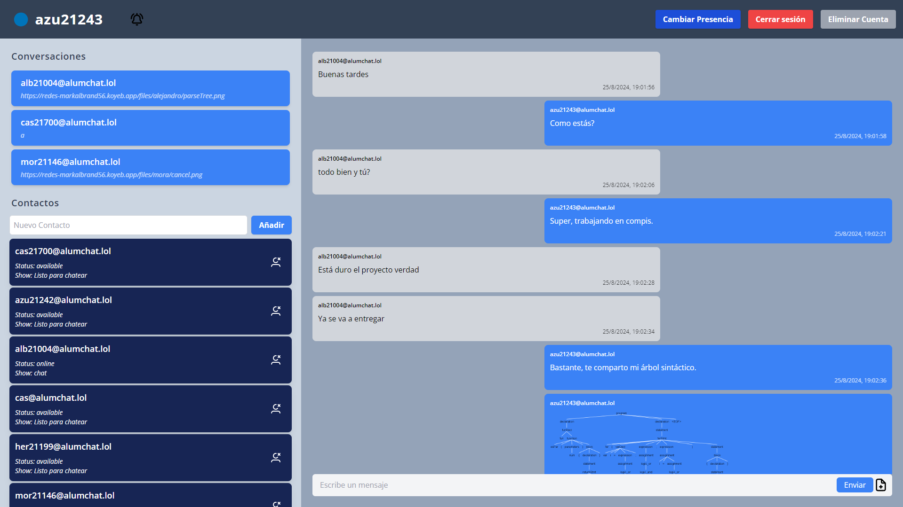
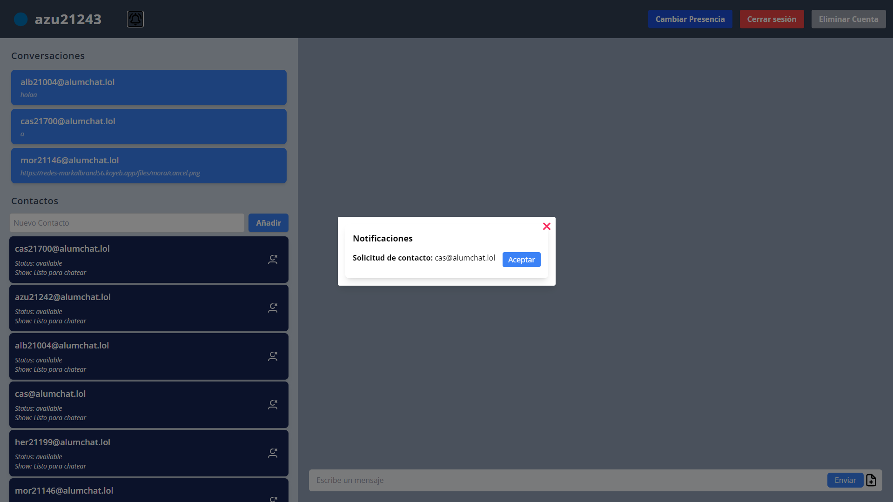

# XMPP Client
*Universidad del Valle de Guatemala, Agosto de 2024*  
*Redes de Computadoras CC3067*  
*Done by: Alejandro Azurdia*

## Description
The XMPP client is an instant messaging application developed in React that allows users to connect to an XMPP server, send and receive messages, manage contacts, and change their presence status. It uses the @xmpp/client library for communication with the XMPP server and is configured to work with the alumchat.lol server. The user interface is designed with Tailwind CSS and supports conversation viewing, file sending, and notification management.

---
## Screenshots

---
## Implemented Features
- [x] **Register a new account on the server**
- [x] **Log in with an existing account**
- [x] **Log out of an account**
- [x] **Delete an account from the server**
- [x] **Display all contacts and their status**
- [x] **Add a user to the contact list**
- [x] **View contact details**
- [x] **One-on-one communication with any user/contact**
- [ ] **Participate in group conversations**
- [x] **Set presence message**
- [x] **Send/receive notifications**
- [x] **Send/receive files**

